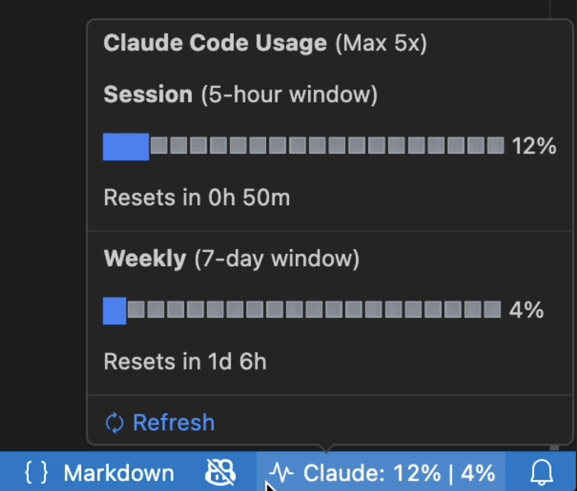
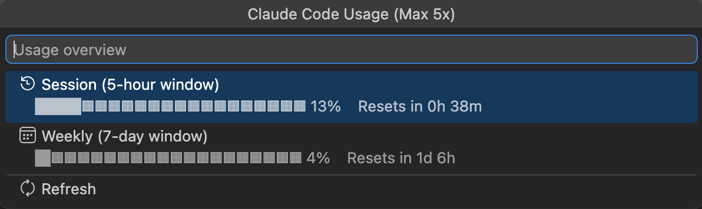

# Claude Usage — VS Code Extension

Shows your [Claude Code](https://docs.anthropic.com/en/docs/claude-code) (Pro/Max) usage limits directly in the VS Code status bar — no need to check the browser.

## Features



- **Status bar** shows `Claude: 12% | 4%` (5-hour session | 7-day weekly usage)
- **Hover** for a rich tooltip with progress bars, reset timers, and your plan name
- **Click** for a QuickPick panel with full usage details



- Color-coded warnings: yellow at 70%, red at 90%
- Auto-polls every 60 seconds; click to refresh manually
- Only polls in focused windows to avoid unnecessary API calls

## Requirements

- **macOS only** — uses the macOS Keychain to read credentials
- [**Claude Code CLI**](https://docs.anthropic.com/en/docs/claude-code) installed and signed in (Pro or Max plan)
- **VS Code 1.94.0** or later

## Install

**From the VS Code Marketplace:** search for "Claude Usage" in the Extensions panel, or install from the [Marketplace page](https://marketplace.visualstudio.com/items?itemName=smanettu.vscode-claude-usage).

**Manual install:**

```bash
git clone https://github.com/smanettu/vscode-claude-usage.git
cd vscode-claude-usage
npm install
npm run compile
npx @vscode/vsce package
code --install-extension vscode-claude-usage-*.vsix
```

Restart VS Code after installing. The usage indicator appears in the bottom-right status bar.

## How Authentication Works

The extension reads the OAuth token that **Claude Code CLI** stores in the macOS Keychain. No API keys or manual configuration needed — if you're signed into Claude Code CLI, it just works.

- The extension makes exactly one outbound HTTPS connection: to `api.anthropic.com`
- No telemetry, no third parties
- macOS Keychain access control applies; first run triggers a one-time "allow access?" dialog
- The token is cached in memory only and cleared when VS Code closes

> **Note:** The usage API endpoint is undocumented and could change without notice.

## Development

```bash
npm run compile    # Build once
npm run watch      # Watch mode
# Press F5 in VS Code to launch Extension Development Host
```

## License

[MIT](LICENSE)

---

> Built by [Vincenzo Vitale](https://github.com/vincenzovitale) with [Claude Code](https://docs.anthropic.com/en/docs/claude-code).
